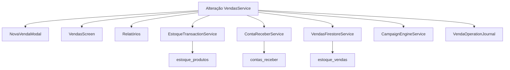

# CHANGE IMPACT — Matriz de impacto de alterações

**Uso:** antes de modificar um serviço/módulo, consultar o que quebra.

---

## Se alterar `EstoqueTransactionService`

| Impacto | Detalhe |
|---------|---------|
| **Telas** | `nova_venda_modal`, `estoque_screen`, `pre_pedidos_screen`, `public_catalog_screen`, compras pipeline |
| **Serviços** | `vendas_service`, `sale_intent_service`, `pre_pedido_service`, `catalogo_venda_service`, `compra_para_pipeline_service` |
| **Firestore** | `estoque_produtos`, `estoque_baixa_pagamento`, `produtos` (remoção catálogo) |
| **Hive** | `produtos_{lojaId}` |
| **Risco** | **Muito Alto** — stock negativo, dupla baixa, LWW, conflito revision |
| **Testes mínimos** | Venda simples, combo, variação, fiado, catálogo, rollback, `m23_r84_stock_enforcement_test` |
| **R8.4** | `stockRevision` + `stockOperationId` + rules Firestore; ver `stock-version-contract.md` |

---

## Se alterar `VendasService`

| Impacto | Detalhe |
|---------|---------|
| **Telas** | `nova_venda_modal`, `vendas_screen`, `relatorio_*`, `metas_comissoes_*` |
| **Serviços** | EstoqueTX, Journal, CR, ClientesFS, VendasFS, CampaignEngine |
| **Hive** | `vendas_{lojaId}`, `clientes_{lojaId}`, `contas_receber_{lojaId}` |
| **Firestore** | `estoque_vendas`, `contas_receber`, `estoque_clientes` |
| **Risco** | **Muito Alto** |
| **Fluxos** | PDV, fiado, consignado, exclusão, edição |

---

## Se alterar `ProdutosService` / `ProdutosFirestoreService`

| Impacto | Detalhe |
|---------|---------|
| **Telas** | `produto_form_screen`, `estoque_screen`, `catalogo_interno_screen` |
| **Serviços** | CatalogoSync, CatalogPublish, AutoSync, CriticalListener |
| **Firestore** | `estoque_produtos`, `produtos`, `draft_produtos` |
| **Hive** | `produtos_{lojaId}` |
| **Risco** | Alto — catálogo e estoque desalinhados |

---

## Se alterar `FullSyncService`

| Impacto | Detalhe |
|---------|---------|
| **Telas** | `login_screen`, `app_start_router`, `splash_screen` |
| **Serviços** | Todos os *FirestoreService de sync |
| **Hive** | Todas as boxes por lojaId |
| **Risco** | Alto — sobrescrita dados locais no login |

---

## Se alterar `LojaIdService` / `StoreResolverService`

| Impacto | Detalhe |
|---------|---------|
| **Callers** | 59 + 50 (facade) — **quase toda a app** |
| **Risco** | **Muito Alto** — dados tenant errado |
| **Incidente** | RCA-001 Thawana |

---

## Se alterar `ClienteAuthService`

| Impacto | Detalhe |
|---------|---------|
| **Telas** | `public_catalog_screen`, auth cliente, `perfil_cliente_*` |
| **Firestore** | `clientes`, `cupons`, `campanhas_sorteio/participantes` (21 writes) |
| **Risco** | Alto — auth catálogo público |

---

## Se alterar `FinanceiroFirestoreService`

| Impacto | Detalhe |
|---------|---------|
| **Telas** | `financeiro/*`, `contas_receber_screen`, `relatorios_financeiros_*` |
| **Serviços** | CR, CP, Fechamento, SoftDelete |
| **Risco** | Alto — integridade financeira |

---

## Se alterar `CatalogPublishService`

| Impacto | Detalhe |
|---------|---------|
| **Telas** | `estoque_screen`, `admin_publish_bar`, `loja_config_screen` |
| **Firestore** | `draft_*` → `produtos`, `config` |
| **Risco** | Alto — catálogo público quebrado |

---

## Se alterar `PublicCatalogScreen`

| Impacto | Detalhe |
|---------|---------|
| **Utilizadores** | Clientes finais (web) |
| **Serviços** | 12+ services importados |
| **Risco** | Alto — receita catálogo |
| **Nota** | Zona protegida banners — regra Cursor |

---

## Matriz resumo

| Serviço alterado | Telas afectadas | Serviços dependentes | Risco |
|------------------|-----------------|---------------------|-------|
| EstoqueTransactionService | 5+ | 6+ | Muito Alto |
| VendasService | 8+ | 10+ | Muito Alto |
| LojaIdService | **Todas admin** | 59+ | Muito Alto |
| StoreResolverService | Login, Home | 50+ | Muito Alto |
| ProdutosFirestoreService | 4+ | 8+ | Alto |
| FullSyncService | 3+ | 10+ | Alto |
| ClienteAuthService | 5+ | 3+ | Alto |
| FinanceiroFirestoreService | 6+ | 5+ | Alto |
| CatalogPublishService | 3+ | 4+ | Alto |
| CampaignEngineService | 2+ | 1 | Médio |
| CompraFornecedorFirestore | 5 | 3 | Médio |

---

## Diagrama impacto venda

---

## Alterações em Firestore Rules

| Collection afectada | App modules |
|---------------------|-------------|
| `estoque_produtos` | PDV, estoque, catálogo |
| `config/payments` | Checkout, MP |
| `clientes` | CRM, catálogo, cupons |
| `contas_receber` | Fiado, financeiro |

---

## Alterações em Hive box names

| Box | Impacto |
|-----|---------|
| `produtos_{lojaId}` | Estoque, venda, catálogo interno |
| `vendas_{lojaId}` | PDV, relatórios |
| `venda_operation_journal_{lojaId}` | Recovery venda |
| `sync_queue` | Toda sync pendente |

**Nunca renomear box sem migração** — dados locais perdidos.

---

## NÃO IDENTIFICADO nesta versão

- Impacto automático por método (requer análise AST)
- Cobertura de testes por módulo
- Mapa de features por plano vs impacto
