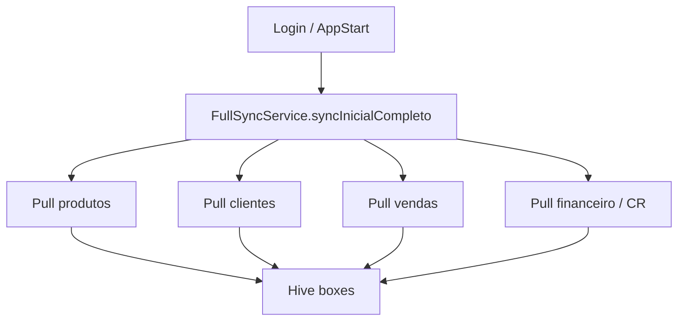
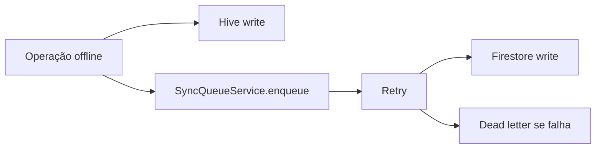

# Fluxo — Sincronização

**Serviços:** `FullSyncService`, `SyncQueueService`, `AutoSyncService`, `FirestoreCriticalListenerService`

---

## Sync inicial (login)

Regra conflito: preservar local se `updatedAt` mais novo ou fila pendente.

---

## Fila offline

---

## Listeners (push remoto → local)

`FirestoreCriticalListenerService`:

- `estoque_produtos` → sync produtos Hive
- `usuarios/{email}` → permissões
- `vendedores/{uid}` → permissões vendedor

Debounce antes de `SyncQueueService.processPending`.

---

## Estoque — stockRevision (R8.4)

| Campo | Papel |
|-------|-------|
| `stockRevision` | Ordenação monotônica da grade (sem timestamp) |
| `stockOperationId` | Idempotência / confirmação |
| `pendingStockOperationId` | Pendência local explícita |
| `stockSyncState=conflict` | Remoto avançou com op diferente durante pendência |

Pull: `evaluatePullStockMergeByRevision` — nunca sobrescrever grade local stale.
Push: bloqueado em `conflict`; rules rejeitam revision inválida.
Testes: `m23_r84_stock_enforcement_test.dart`, `npm run test:rules:stock`.

---

## Sync por domínio

| Domínio | Serviço |
|---------|---------|
| Produto | `ProdutoAutoSyncService`, `CatalogoSyncService` |
| Compra | `CompraFornecedorSyncService` |
| CR/Financeiro | `ContaReceberFinanceiroSyncService` |
| Cloud config | `CloudSyncService` |

---

## Recovery

- `ProdutoSyncRecoveryService` + tela `produto_sync_recovery_screen.dart`
- Journal venda: `VendaOperationJournalService`

---

## Riscos

| Risco | Detalhe |
|-------|---------|
| Listener LWW | Sobrescreve Hive com snapshot incompleto |
| Fila travada | Dead letters em `SyncQueueService` |
| Multi-dispositivo | Tombstones `exclusao_produto` |

Ver [../performance/FINDINGS.md](../performance/FINDINGS.md)
